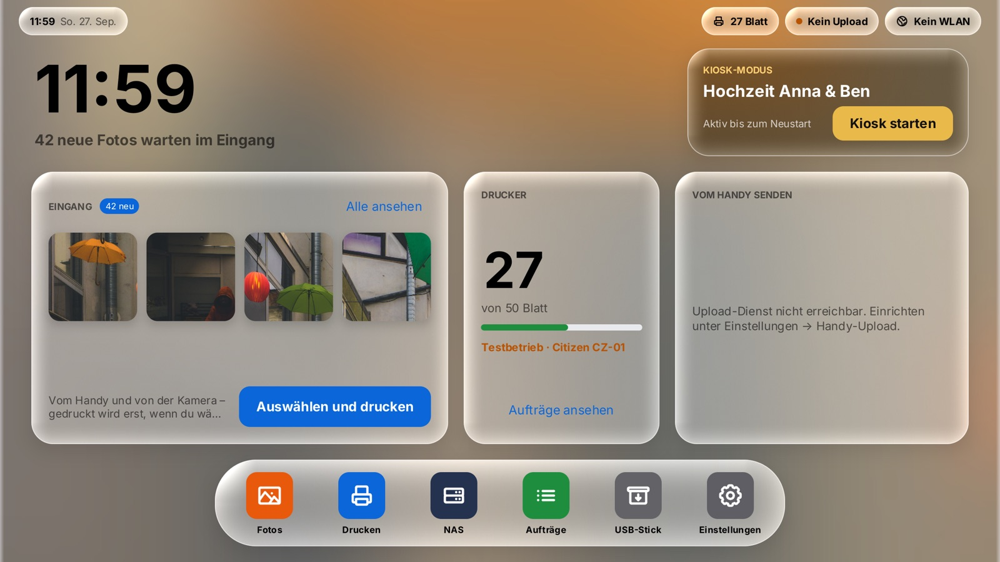
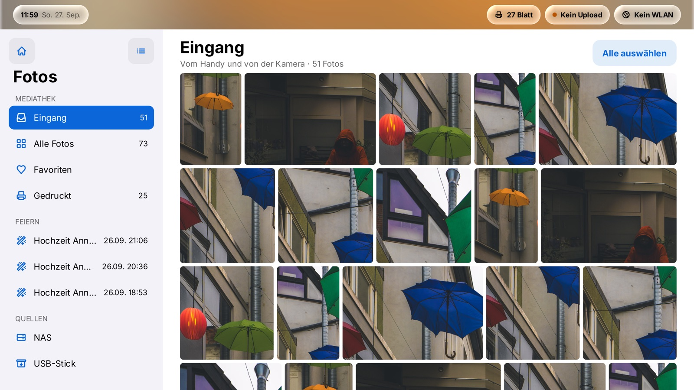
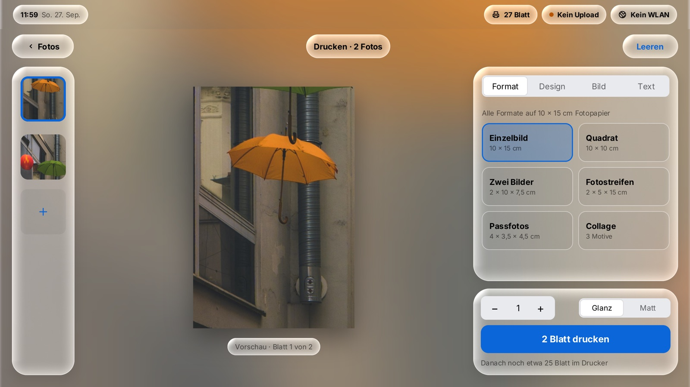
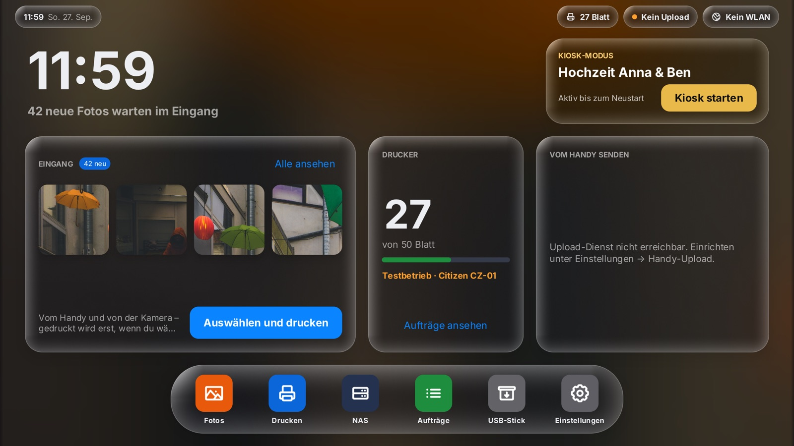
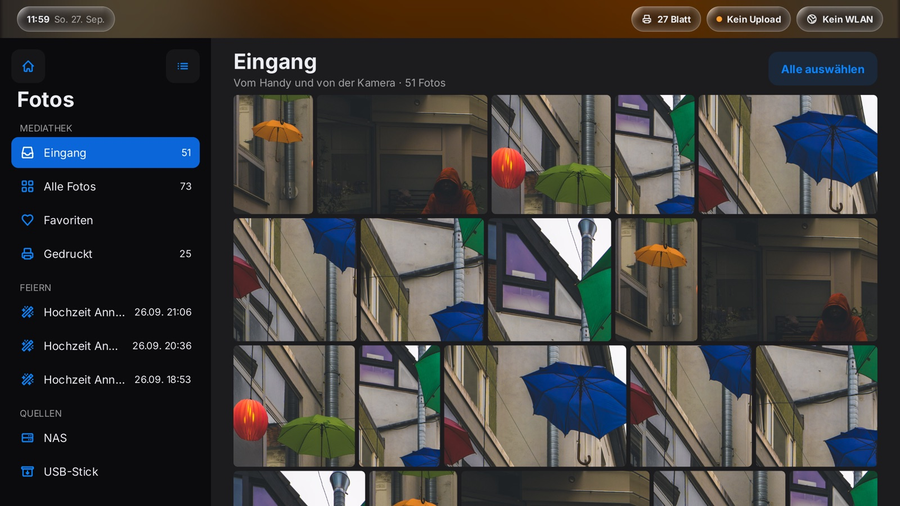
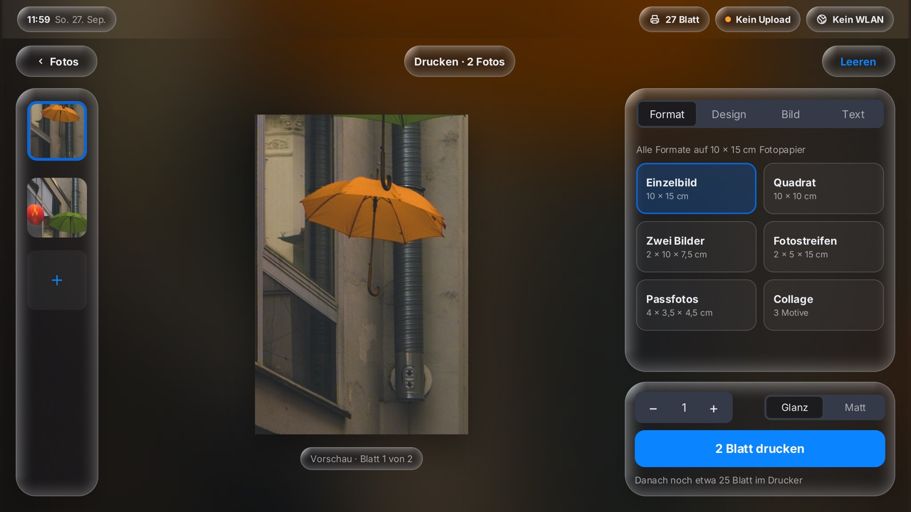
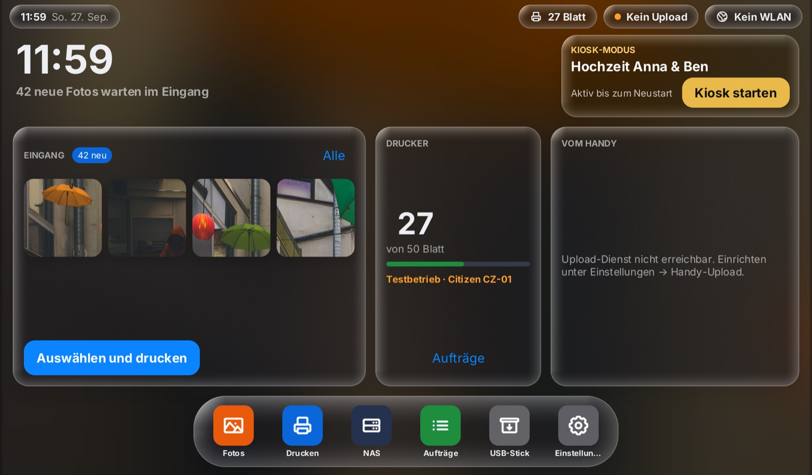
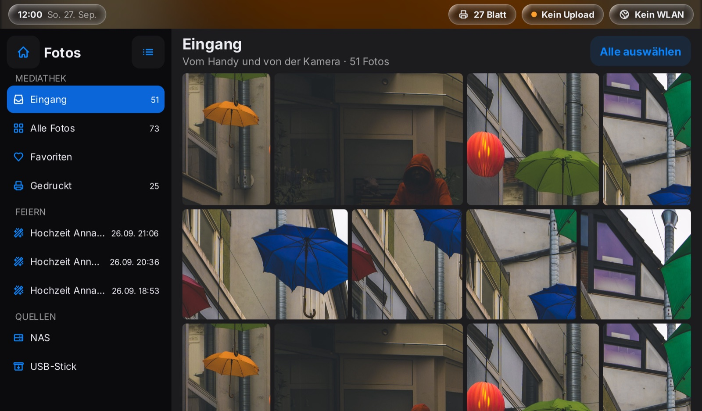
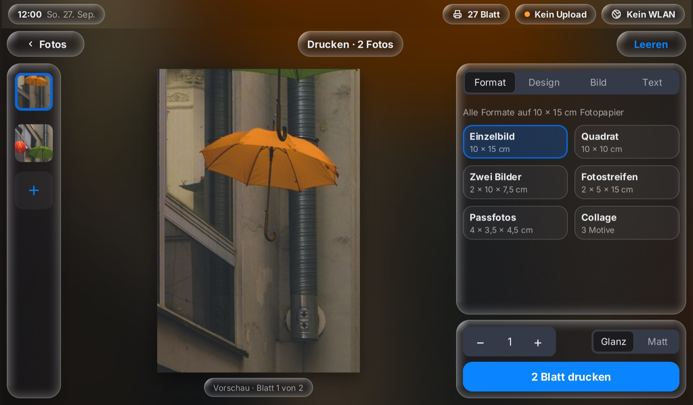

# eventprint – Fotodrucker für zuhause, Fotobox für Feiern

Ein Raspberry Pi mit Touchscreen und einem Citizen CZ-01 (10 × 15 cm,
Thermosublimation). Nach dem Einschalten ist er ein **Heimdrucker**, der sich
wie ein Tablet bedienen lässt. Für eine Feier lässt er sich in den **Kiosk**
versetzen; dort bedienen ihn Gäste, bis er das nächste Mal eingeschaltet wird.

Die Oberfläche zeichnet [gift](https://github.com/worldiety/gift) direkt auf
die GPU, ohne Browser. Die Einrichtung des Druckers ist getrennt dokumentiert:
**[DRUCKER.md](DRUCKER.md)**.

---

## Was das Gerät kann

**Im Heimbetrieb**

* **Home-Bildschirm** mit Eingang, Druckerstand, QR-Code zum Senden vom Handy,
  App-Symbolen und dem Start in den Kiosk.
* **Eingang:** Fotos vom Handy (per QR-Code, mehrere auf einmal) und von der
  Kamera landen hier und werden **nicht** von allein gedruckt.
* **Fotos:** Mediathek mit Eingang, allen Fotos, Favoriten, Gedrucktem und den
  Fotos vergangener Feiern, als Ziegelreihen im Seitenverhältnis der Fotos,
  mit Mehrfachauswahl.
* **Quellen:** NAS im Heimnetz per SMB, etwa eine Synology DiskStation
  (Ordner durchsuchen, Vorschaubilder vom NAS, Übernahme der Originale), und
  USB-Stick.
* **Druck-Studio** mit echter Vorschau aus dem Renderer des Druckers:

  | | |
  |---|---|
  | Format | Einzelbild, Quadrat, zwei Bilder, Fotostreifen, Passfotos in echter Größe (35 × 45 mm), Collage |
  | Design | randlos, Passepartout (1 cm), Polaroid, Film, Galerie – in Weiß, Creme oder Schwarz |
  | Bild | Farbanmutung (Original, Schwarzweiß, warm, kühl, Vintage), Ausschnitt auf Gesichter |
  | Text | Beschriftung im Polaroidsteg, drei Schriften, Datumsstempel |
  | Druck | Anzahl, Oberfläche glänzend oder matt |

  Alle Formate teilen sich das eine 10×15-Papier.
* **Aufträge** mit Druckerzustand, Wiederholen, Abbrechen, Freigabe nach dem
  Papierwechsel und einem selbst gezählten Papiervorrat.
* **Einstellungen** wie auf einem Tablet: WLAN, Drucker & Papier,
  Handy-Upload, Konten & Quellen, Kiosk-Modus, Speicher & USB, Info.
* **Weitergabe:** Fotos einer Feier, eine Auswahl oder alle auf einen
  USB-Stick kopieren.
* **HEIC** von iPhones, sofern libheif installiert ist.

**Im Kiosk**

* Dunkler Bildschirm in der Farbe der Feier mit QR-Code und den Fotos dieser
  Feier – nur dieser. Die Mediathek ist nicht erreichbar.
* Ein Tipp auf ein Foto: Layout wählen (formatfüllend, Passepartout,
  Polaroid), Anzahl bis zur eingestellten Grenze, drucken.
* Fotos vom Handy und von der Kamera werden je nach Einstellung sofort
  gedruckt.
* Findet der automatische Polaroid-Ausschnitt mehr Gesichter, als ins
  Polaroid passen, wird das Blatt zum Passepartout mit 1 cm Rand, statt
  Gesichter abzuschneiden.
* Fünfmal schnell auf den QR-Code tippen und die PIN eingeben öffnet die
  Betreuung: Drucker freigeben, Papier melden, Fotos auf USB kopieren, Kiosk
  beenden. Sonst endet der Kiosk mit dem nächsten Einschalten.

## Schnellstart

Am Schreibtisch, ohne Drucker (Testbetrieb) und ohne OpenCV:

```bash
go run -tags nofacecrop ./cmd/gift-app -window
```

Die Daten liegen dann unter `~/.local/share/eventprint`. Bilder, die man in
dessen Unterordner `camera/` legt, kommen an wie Aufnahmen einer Kamera.
`-tags giftauto` schaltet zusätzlich die Automatisierungsschnittstelle von
gift auf `127.0.0.1:7391` ein (Screenshots, Eingaben) – nie für das Gerät
bauen.

## Bauen und prüfen

```bash
./scripts/build.sh
```

Das ist die vollständige Schleife und die einzige, deren Reihenfolge feststeht:

```
go build  ->  go test | speclink evidence  ->  speclink verify  ->  speclink generate
```

Der Nachweis läuft **vor** der Prüfung, weil `speclink verify` wissen will,
welche Tests tatsächlich durchgelaufen sind. Umgekehrt prüfte es einen Nachweis
von gestern. Am Ende stehen die Binärdateien in `dist/` und die abgeleitete
Spezifikation in [SPECIFICATION.md](SPECIFICATION.md).

| Variable | Wirkung |
|---|---|
| `FACECROP=0` | ohne Gesichtserkennung bauen, also ohne OpenCV und gocv |
| `SKIP_TESTS=1` | nur bauen; die Spezifikation entsteht dann nicht |
| `TARGETS` | z. B. `"linux/arm64 linux/amd64"` |

`gift-app` braucht cgo und OpenCV, `photoupld` nicht. Für eine fremde
Architektur wird `gift-app` deshalb übersprungen statt in einer Binärdatei zu
enden, die auf dem Zielgerät nicht startet.

### speclink

Die Anforderungen liegen als Go-Quelltext in `requirements/`, die
Quelldokumente darunter in `requirements/_sources/`. Jeder Anwendungsfall nennt
in einer `*.annotation.go` neben sich die Anforderung, für die er geschrieben
wurde; jeder Test endet mit `spec.Verified(t, …)`. Vier Zahlen müssen alle 100 %
erreichen, sonst schlägt der Bau fehl:

```
15 source segments (100% accounted), 30 constructs (100% bound),
15 normative requirements (100% covered, 100% verified), 0 findings
```

*accounted* fragt, ob jeder Abschnitt der Quelldokumente zu einer Anforderung
geworden ist. *bound* fragt, ob jeder Anwendungsfall eine Anforderung nennt.
*covered* fragt die Gegenrichtung. *verified* ist die einzige, die danach
fragt, ob überhaupt etwas gezeigt hat, dass der Quelltext tut, was die
Anforderung verlangt.

`speclink.lock` gehört ins Repository: Darin steht, welcher Test welche
Anforderung wann gezeigt hat und in welchem Wortlaut. Wird eine Anforderung
umformuliert, verfällt der Nachweis und muss neu erbracht werden.

## Installation auf einem Raspberry Pi

Auf einem frischen Raspberry Pi OS oder Debian, als root:

```bash
git clone https://github.com/torbenschinke/eventprint.git
cd eventprint
sudo ./scripts/install.sh --dry-run     # zeigt nur, was geschähe
sudo ./scripts/install.sh
```

Danach liegen dort:

| Ort | Inhalt |
|---|---|
| `/opt/eventprint` | Arbeitskopie des Repositories |
| `/var/lib/eventprint` | Daten: Fotos, Druckaufträge, Archiv der Originale |
| `/etc/default/eventprint` | Umgebung der Dienste, von Hand änderbar |
| `eventprint.service` | die Fotobox |
| `eventprint-update.service` | holt beim Hochfahren den aktuellen Stand |

Der Dienst läuft als eigener Nutzer `eventprint` in den Gruppen `lp`,
`lpadmin`, `plugdev` und `video`. `lpadmin` ist die SystemGroup von CUPS und
nicht verzichtbar: nur damit darf die Fotobox die Fehlerbehandlung ihrer
Warteschlange auf `abort-job` stellen. Seine Daten legt der Dienst unter
`StateDirectory` ab, das systemd auf `/var/lib/eventprint` setzt und das nago
von sich aus auswertet.

Das Einrichten des Druckers gehört **nicht** dazu — das hängt am Gerät und an
seiner Seriennummer, siehe [DRUCKER.md](DRUCKER.md).

Scheitert der Bau an gocv, ist fast immer die OpenCV-Fassung der Distribution
älter als die, gegen die gocv übersetzt. Dann hilft:

```bash
sudo ./scripts/install.sh --no-facecrop
```

Die Fotobox läuft damit ohne Gesichtserkennung; der Bildausschnitt ist dann
durchgehend mittig, also genau das Verhalten, das auch die Erkennung ohne
Treffer zeigt.

### Aktuell bleiben

`eventprint-update.service` läuft vor der Fotobox und holt den Stand von
`origin/<branch>`. Hat sich nichts geändert, endet er sofort; sonst baut er neu.

Zwei Regeln bestimmen das Verhalten:

* **Der Dienst startet immer.** `update.sh` endet grundsätzlich mit Erfolg, und
  die Unit ist über `Wants=` verknüpft, nicht über `Requires=`. Kein Netz auf
  einer Feier ist der Normalfall, kein Fehlerfall.
* **Es bleibt immer eine lauffähige Binärdatei da.** Gebaut wird neben den
  laufenden Stand und erst nach Erfolg umgehängt.

Geprüft wird beim Hochfahren nicht. Ein roter Testlauf um 18 Uhr auf einem
Raspberry Pi stünde niemandem zur Verfügung, und die Feier begänne trotzdem.
Dafür ist `scripts/build.sh` da.

Das Gerät ist ein Abbild des Repositories, keine Arbeitskopie: `update.sh`
setzt mit `git reset --hard` auf den Stand der Gegenseite. Lokale Änderungen
unter `/opt/eventprint` gehen dabei verloren.

Damit das nicht das falsche Verzeichnis trifft, bricht `update.sh` ab, sobald
das Arbeitsverzeichnis lokale Änderungen hat. Ein Gerätecheckout hat nie
welche; ein Entwicklungsverzeichnis immer. Das Skript bezieht sein Ziel aus
seinem eigenen Ort, nicht aus dem Arbeitsverzeichnis des Aufrufers — ein Aufruf
mit absolutem Pfad aus einem anderen Verzeichnis heraus meint also weiterhin
den Checkout, in dem das Skript liegt.

## Einrichten

Alles lässt sich am Gerät unter **Einstellungen** einrichten. Was man nicht
auf einem Touchscreen tippen möchte – Tokens und Zugangsdaten –, steht besser
in `/etc/default/eventprint`; die Werte gelten als Vorbelegung, solange in den
Einstellungen nichts steht.

| Variable | Bedeutung |
|---|---|
| `EVENTPRINT_PRINTER` | CUPS-Warteschlange, z. B. `CZ01`; leer = Testbetrieb |
| `EVENTPRINT_RELAY_URL` | Basis-URL des Upload-Dienstes `photoupld` |
| `EVENTPRINT_RELAY_TOKEN` | Zugangstoken der Box beim Upload-Dienst |
| `EVENTPRINT_NAS_HOST` | NAS: Name oder Adresse, auch `smb://diskstation/photo` |
| `EVENTPRINT_NAS_USER`, `EVENTPRINT_NAS_PASSWORD` | NAS: Anmeldung |
| `EVENTPRINT_NAS_SHARE` | NAS: Freigabe, z. B. `photo` |
| `EVENTPRINT_CAMERA_DIR` | Tethering-Ordner; `off` schaltet die Kamera ab |
| `EVENTPRINT_UI_SCALE` | feste Vergrößerung der Oberfläche statt der automatischen, siehe *Bildschirme* |
| `EVENTPRINT_UI_DENSITY` | Pixeldichte 1 oder 2 erzwingen (sonst nach Panelgröße) |
| `EVENTPRINT_ROTATE` | Drehung des Touchscreens: `auto` (Vorgabe), `normal`, `left`, `right`, `inverted` |
| `EVENTPRINT_PRIMARY_OUTPUT` | Ausgang des Touchscreens, falls die Wahl daneben liegt, z. B. `HDMI-1` |
| `EVENTPRINT_DATA_DIR`, `EVENTPRINT_RUNTIME_DIR` | nur zum Entwickeln; unter systemd gelten `/var/lib/eventprint` und `/run/eventprint` |

### Drucker

**Einstellungen → Drucker & Papier.** Die Warteschlange wird aus `lpstat -a`
angeboten. Solange keine gewählt ist, läuft das Gerät im Testbetrieb: Aufträge
durchlaufen alles einschließlich Rendering, das Ergebnis wird verworfen.
Dort stehen auch die Druckgeschwindigkeit und der Papiervorrat; nach dem
Einlegen eines neuen Sets tippt man **Neues Set eingelegt**.

### Wenn der Drucker steht

Bei leerem Papier oder Farbband und bei einer abgerissenen USB-Verbindung
beendet sich das Gutenprint-Backend mit Status 4 („stop printer“), und CUPS
**hält die Warteschlange an**. Das Gerät gibt sie selbst wieder frei, erst
nach 15 Sekunden, dann mit wachsendem Abstand. Direkt nach dem Papierwechsel
tippt man im Druckdialog **Eingelegt – weiter drucken** oder unter
**Aufträge** auf **Drucker freigeben**. Kein Blatt wird dabei doppelt
gedruckt.

### Upload vom Handy

`photoupld` ist ein kleiner Nago-Dienst im Internet; das Gerät selbst bleibt
von außen unerreichbar und fragt ihn regelmäßig ab.

**Dienst einrichten** (einmal, durch den Betreiber):

1. `go run ./cmd/photoupld` auf dem öffentlichen Server starten.
2. Als `admin@localhost` anmelden und unter **Einstellungen → Foto-Upload** die
   öffentliche Basis-URL eintragen.
3. Einen Mailserver (SMTP) im Admin-Center hinterlegen. Über ihn gehen die
   Kopplungscodes hinaus.

**Box koppeln** (durch jeden registrierten Nutzer, für beliebig viele Boxen):

1. An der Box **Einstellungen → Handy-Upload**, die Adresse des Dienstes und
   die eigene Mailadresse eintragen, **Code per Mail anfordern**.
2. Den sechsstelligen Code aus der Mail auf dem Ziffernfeld eintippen. Er
   gilt 30 Minuten; nach fünf falschen Versuchen ist er verbraucht.
3. Fertig: Dienst und Box tauschen das Zugangstoken selbst aus. Es trägt die
   Rolle **Fotobox-Relay**, heißt in der Verwaltung „Fotobox „…““ nach dem
   Titel der Feier und lässt sich dort löschen. Der Nutzer bekommt eine Mail,
   dass eine Box gekoppelt wurde.

Unter **Meine Fotoboxen** im Upload-Dienst sieht jeder Nutzer die Boxen, die
er gekoppelt hat, und trennt sie selbst – etwa bevor er eine Box verleiht.
Der Menüpunkt erscheint nach dem ersten Koppeln (Rolle **Fotobox-Besitzer**).

Einen Code bekommt nur, wer registriert ist, seine Adresse bestätigt hat und
nicht gesperrt ist. Die Box erfährt nie, ob es ein Konto gibt. Ein von Hand
angelegtes Token lässt sich an der Box unter **Token von Hand eintragen**
weiterhin verwenden, ebenso `EVENTPRINT_RELAY_URL` und
`EVENTPRINT_RELAY_TOKEN`.

Der QR-Code im Heimbetrieb trägt `m=inbox`: Die Upload-Seite fragt dann keine
Gestaltung ab und nimmt mehrere Bilder auf einmal, die im Eingang landen. Im
Kiosk fehlt der Parameter, und die Seite fragt wie bisher nach dem Layout;
das Bild wird sofort gedruckt. Für HEIC braucht auch der Server libheif
(`apt install libheif1`); fehlt sie, meldet das Protokoll es beim Start.

### NAS (Synology und andere SMB-Freigaben)

**Einstellungen → Konten & Quellen.** Adresse (`diskstation.local` oder die
IP-Adresse), Benutzer und Kennwort eintragen, **Anmelden und Freigaben
suchen** tippen und die Freigabe mit den Fotos wählen – bei Synology meist
`photo` oder `home`. Danach stehen die Fotos unter **Fotos → NAS** und hinter
dem App-Symbol **NAS**.

* Die Box spricht SMB 2/3 selbst (reines Go, `go-smb2`). Sie hängt nichts ein,
  braucht dafür weder root noch eine polkit-Regel und liest nur.
* Vorschaubilder kommen aus `@eaDir`, das Synology Photos und die File Station
  anlegen. Ohne sie lädt die Galerie die Originale, was spürbar langsamer ist.
* Das Kennwort liegt in den Einstellungen auf der Speicherkarte, nur für den
  Dienstnutzer lesbar. Am besten legt man auf dem NAS einen eigenen Benutzer an,
  der die Fotoordner nur lesen darf.
* SMB1 wird nicht unterstützt; DSM hat es seit Version 7 ohnehin abgeschaltet.

### Bildschirme

Die Oberfläche bemisst sich selbst nach dem angeschlossenen Panel. Getestet
ist sie mit 800 × 480, 1024 × 600, 1280 × 720 und Full-HD.

* **Größe:** Aus Auflösung und der Größe in Millimetern, die das Panel über
  xrandr meldet, rechnet sie die Pixeldichte aus und vergrößert so, dass ein
  Knopf etwa 8 mm hoch ist. Meldet ein Panel keine oder eine unglaubwürdige
  Größe, wie viele billige HDMI-Panels, gilt die Auflösung allein.
  **Einstellungen → Anzeige** zeigt, was erkannt wurde.
* **Anordnung:** Unter etwa 1100 × 640 Punkten wird kompakt angeordnet:
  schmalere Spalten, knappere Texte, und die Einstellungen sind Liste und
  Detail wie am iPhone. Dialoge scrollen, wenn sie nicht passen; ihre Knöpfe
  bleiben stehen.
* **Dichte:** Auf dichten Panels ab etwa 180 ppi, etwa dem Touch Display 2,
  setzt die Anzeigesitzung `Xft.dpi` auf 192. Damit wachsen auch die
  Bausteine von gift mit festen Maßen mit, allen voran die
  Bildschirmtastatur.
* **Drehung:** Das Raspberry Pi Touch Display 2 (5 und 7 Zoll) ist hochkant
  gebaut. Die Sitzung dreht es ins Querformat und legt die Berührung mit
  `xinput map-to-output` passend darauf. Steht das Bild auf dem Kopf, hilft
  `EVENTPRINT_ROTATE=right`.
* **Erscheinungsbild:** Hell, dunkel oder automatisch (dunkel von 20 bis
  7 Uhr), unter **Einstellungen → Anzeige**. Der Kiosk ist immer dunkel.

Zum Ausprobieren am Schreibtisch:

```bash
go run -tags nofacecrop ./cmd/gift-app -window -size 800x480
```

### Schnelles JPEG und Leerlauf

* Kamerafotos werden über libjpeg-turbo dekodiert (`libturbojpeg0`, zur
  Laufzeit geladen, kein cgo), für Vorschaubilder schon beim Dekodieren
  verkleinert. Ohne die Bibliothek bleibt es bei Gos image/jpeg – richtig,
  nur deutlich langsamer; das Protokoll meldet es beim Start.
* Die Druckvorschau rechnet mit auf 1600 Pixel verkleinerten Originalen und
  behält sie samt erkannten Gesichtern, solange man im Druck-Studio
  gestaltet. Gedruckt wird aus der vollen Auflösung.
* Die Oberfläche zeichnet nur, wenn sich etwas ändert, und hält sonst das
  letzte Bild (gift `DrawOnDemand`). Im Leerlauf sind das wenige Bilder in
  der Minute statt sechzig in der Sekunde; der Pi bleibt kühl.
  `EVENTPRINT_DRAW_ALWAYS=1` schaltet zum Vergleich auf ständiges Zeichnen.

### HEIC

iPhones speichern HEIC. `pkg/heif` lädt dafür die Systembibliothek libheif
zur Laufzeit (purego, kein cgo). Ohne sie bleibt es bei JPEG und PNG. Das
Format ist patentbelastet; ob die Nutzung des installierten Codecs zulässig
ist, verantwortet der Betreiber.

## Kamera anschließen

Die Fotobox erkennt unterstützte USB/PTP-Kameras mit `gphoto2` automatisch.
Für den automatischen Polaroid-Bildausschnitt verwendet sie außerdem GoCV mit
OpenCV 4.x und dem eingebetteten YuNet-Modell. Die Systemabhängigkeiten müssen
vor dem Bauen und Starten der Fotobox einmalig installiert sein:

```bash
sudo apt install gphoto2 libopencv-dev pkg-config
```

Der Fotobox-Build benötigt deshalb aktiviertes CGO und eine über
`pkg-config --modversion opencv4` auffindbare OpenCV-Installation. Der separat
gebaute Upload-Service benötigt OpenCV nicht.

Die Kamera kann jederzeit an- oder abgesteckt werden. Spätestens nach zehn
Sekunden startet die Fotobox den Tethering-Betrieb. Beim Auslösen lädt
`gphoto2` die Aufnahme herunter, belässt das Original auf der Speicherkarte
und das Gerät übernimmt sie: im Heimbetrieb in den Eingang, im Kiosk in die
Feier und je nach Einstellung sofort in den Druck. Der Kiosk zeigt, ob die
Kamera bereit ist.

Die zehn Sekunden gelten ausschließlich für die **Suche**, solange keine
Kamera am USB hängt. Reißt ein **laufendes** Tethering ab, wird es sofort
wieder aufgebaut, und die währenddessen entstandenen Aufnahmen werden
anschließend mit `--get-all-files --new` von der Speicherkarte nachgeholt.
Beides ist notwendig, weil `--capture-tethered` nur neu entstehende Bilder
herunterlädt: Jede Sekunde ohne Tethering war vorher eine Sekunde, in der eine
Aufnahme unbemerkt verloren ging.

### Wenn Aufnahmen ausbleiben

Zwei Ursachen sind bekannt, beide stellt `scripts/provision.sh` bei jedem
Hochfahren ab:

Der **Volume-Monitor von GVFS** greift jede PTP-Kamera ab, sobald sie am Bus
auftaucht, und hält sie fest; `gphoto2` meldet dann `Could not claim the USB
device` oder verliert das Gerät im Betrieb. Er wird maskiert, und zusätzlich
wird seine D-Bus-Aktivierung über `/usr/local/share` stillgelegt — die
systemd-Unit allein genügt nicht, weil D-Bus ihn sonst nachstartet.

Der **USB-Autosuspend** legt Geräte nach zwei Sekunden Leerlauf schlafen. Eine
Kamera im Tethering wartet die meiste Zeit auf den Auslöser und gilt damit als
untätig; schläft sie ein, bricht die PTP-Sitzung. Eine udev-Regel hält
Kameras wach.

Eine dritte Ursache lässt sich nicht per Skript abstellen: Die Sony A7 III
lädt ihren Akku über USB, solange **Menü → Einstellungen →
USB-Stromversorgung** eingeschaltet ist. Am Raspberry Pi 400 teilen sich alle
Ports ein gemeinsames Stromlimit; am 05.09.2026 meldete der Kernel
509-mal `over-current`, jede Episode begann am Port der Kamera und riss
Drucker, Touchscreen und Tastatur mit. Die Einstellung gehört deshalb auf
**Aus**, und wenn das nicht reicht, zwischen Pi und Geräte ein aktiver
USB-Hub mit eigenem Netzteil.

Zur Prüfung meldet `gphoto2 --auto-detect` die Kamera, und
`journalctl -u eventprint -f` zeigt `camera connected` beziehungsweise
`camera tethering dropped`.

## Wie Änderungen auf die Box kommen

Beim Hochfahren laufen drei Dienste nacheinander:

```
eventprint-update.service      holt origin/master und baut neu
eventprint-provision.service   gleicht die Systemkonfiguration an
eventprint.service             die Fotobox selbst
```

`update.sh` läuft **unprivilegiert** und tauscht nur die Binärdatei.
`provision.sh` läuft **als root** und richtet alles, was das nicht kann: udev-
Regeln, die Journal-Einstellung, das Stilllegen des Volume-Monitors — und die
systemd-Units selbst, einschließlich seiner eigenen.

Damit ist auch Systemkonfiguration per `git push` zustellbar: pushen, jemanden
vor Ort den Strom ziehen lassen, fertig. Vorher ging das nur mit root vor dem
Gerät, und beim ersten Einsatz stand die Box im Gastnetz hinter NAT — die
Reparatur kostete eine Autofahrt.

Die Reihenfolge ist wichtiger, als sie aussieht: `provision.sh` stammt aus dem
Repository, und der Updater ist es, der das Repository aktualisiert. Liefe das
Provisioning zuerst, arbeitete es mit dem Skript des vorherigen Standes, und
eine Änderung daran bräuchte zwei Neustarts.

**Der Preis ist benannt und angenommen:** Wer auf `master` pushen kann, führt
auf der Box Befehle als root aus.

Rückweg bei einem fehlerhaften Stand: `git revert`, pushen, erneut den Strom
ziehen lassen. `update.sh` endet immer mit Erfolg und behält im Zweifel die
alte Binärdatei, die Box bleibt also startfähig.

### Logs

Raspberry Pi OS hält das Journal im RAM, um die SD-Karte zu schonen
(`40-rpi-volatile-storage.conf`). Nach der ersten Veranstaltung war das Journal
des Abends damit verloren, bevor jemand hineinsehen konnte. `provision.sh` legt
deshalb `99-eventprint-persistent.conf` an — die `99` ist wesentlich, eine `10`
wäre gegen die `40` der Distribution wirkungslos.

Unter **Einstellungen → Fotobox → Kamera** lässt sich der automatische Druck
abschalten und das Standardlayout wählen. Standardmäßig wird jede Aufnahme
sofort als **Polaroid** gedruckt. Heruntergeladene Dateien werden erst nach
erfolgreichem Import und gegebenenfalls erfolgreichem Einreihen des
Druckauftrags entfernt. Ein Bild gilt erst als vollständig übertragen, wenn es
mit seinem Endmarker (JPEG `FFD9`, PNG `IEND`) abschließt; abgeschnittene
Dateien werden nicht importiert. Gescheiterte Druckaufträge werden mit
wachsendem Abstand wiederholt statt im Sekundentakt.

Unter **Einstellungen → Fotobox → Bildausschnitt** kann der automatische
Polaroid-Bildausschnitt deaktiviert werden. Er ist standardmäßig aktiv und
richtet Gruppen sowie Einzelpersonen anhand erkannter Gesichter aus. Werden
keine Gesichter erkannt, bleibt es beim mittigen Standardausschnitt.

## Fotos weitergeben

Jedes Bild liegt unverändert als Datei unter
`/var/lib/eventprint/photos/originals/` – mit EXIF-Block und ursprünglicher
Kompression, HEIC bleibt HEIC. Gedruckt, angezeigt und weitergegeben wird aus
genau dieser Datei.

Nach einer Feier: USB-Stick einstecken, **Einstellungen → Speicher & USB**,
die Feier wählen, **kopieren**, **auswerfen**. Im Kiosk geht das über die
Betreuung. Die Fotos landen in `eventprint/<Datum> <Feier>/` und heißen
`<Aufnahmezeit>_<ursprünglicher Name>`; ein abgebrochener Vorgang lässt sich
wiederholen, schon kopierte Dateien werden übersprungen. Das Gerät hängt den
Stick über udisks ein; die nötige polkit-Freigabe steht in
`deploy/polkit/51-eventprint-udisks.rules`.

## Aufbau

Die Anwendung folgt dem Layout, das speclink unter dem Profil `go_nago_ddd1`
prüft: Fachlichkeit unter `app/<kontext>/`, ein Anwendungsfall je Datei,
Verdrahtung an genau einer Stelle. Die Domäne nutzt Nagos kleine
Grundtypen (`permission.Auditable`, `data.Repository`), aber keinen
Nago-Webserver.

```
app/device/          Betriebsart, Einstellungen, PIN, Rollen, Annahme eingehender Bilder
app/device/cfg/      Verdrahtung aller Kontexte (die einzige Stelle, die Adapter wählt)
app/device/ui/       Oberfläche mit gift (Heimbetrieb und Kiosk)
app/photo/           Fotos: Import, Mediathek, Eingang, Feiern, Originale
app/printing/        Gestaltung, Renderer, Druckaufträge, CUPS-Anbindung
app/relay/           Box-Seite des Upload-Dienstes
app/camera/          Tethering mit gphoto2
app/nas/             NAS per SMB: Freigaben, Ordner, Vorschaubilder, Übernahme
app/usb/             USB-Sticks: erkennen, kopieren, auswerfen, lesen
app/wifi/            Funknetz über NetworkManager
app/upld/            Upload-Dienst: Sitzungen, Warteschlangen
app/pairing/         Upload-Dienst: Boxen per Mail und Einmalcode koppeln
app/photoupld/       Upload-Dienst: Verdrahtung und Seite für das Handy

pkg/xgift/           generische gift-Bausteine, gedacht für upstream
pkg/heif/            HEIF über libheif per purego
pkg/orient/          EXIF-Ausrichtung
pkg/facecrop/        Gesichtserkennung (OpenCV)

cmd/gift-app/        das Gerät
cmd/photoupld/       der Upload-Dienst im Internet
requirements/        Anforderungen und ihre Quelldokumente
```

Einige Entscheidungen, die beim Lesen sonst überraschen:

* **Es gibt keine Benutzerkonten.** Wer vor dem Bildschirm steht, ergibt sich
  aus der Betriebsart: im Heimbetrieb der Besitzer, im Kiosk ein Gast, nach
  der PIN die Betreuung. Diese Rolle ist das Subjekt, gegen das jeder
  Anwendungsfall seine Berechtigung prüft. Dass Gäste die Mediathek nicht
  sehen, hängt deshalb an den Anwendungsfällen und nicht an der Oberfläche –
  auch ein privates Foto, dessen Kennung ein Gast kennt, bleibt verborgen.
* **Der Kiosk-Zustand liegt in `/run/eventprint`.** Ein Neustart des Dienstes
  (Absturz) findet ihn wieder, ein Neustart des Geräts nicht. Genau das ist
  der Weg zurück in den Heimbetrieb.
* **Ein Renderer für alles.** Die drei Kiosk-Layouts sind Kombinationen des
  allgemeinen Layouts, und die Vorschau entsteht mit demselben Renderer wie
  der Ausdruck.
* **Ein Auftrag je Blatt.** Ein Papierwechsel mitten im Stapel wiederholt
  genau das fehlende Blatt.
* **Gedruckt wird aus dem Original**, aufgerichtet erst beim Rendern. Die
  Datei bleibt, was Kamera oder Handy geliefert haben.
* **Das gerenderte JPEG bekommt ein JFIF-Segment**, sonst erkennt CUPS den
  Typ nicht; siehe [DRUCKER.md](DRUCKER.md).
* **Die Oberfläche läuft im Dienst, nicht in der Sitzung.** `eventprint.service`
  startet `gift-app` als Nutzer `eventprint` und zeichnet in die X-Sitzung des
  Kiosk-Nutzers, die ihm das mit `xhost` erlaubt. So behält der Dienst seine
  Daten, seine polkit-Freigaben und einen Aufpasser, der ihn neu startet.

## Druckqualität

### Exakter CZ-01-Rastervertrag

Gutenprints PPD deklariert für 4x6 eine Bildfläche von **1266x1836 Pixeln bei
300 dpi**. Sie enthält den randlosen Überstand um das sichtbare
1200x1800-Pixel-Papier. Die Anwendung erzeugt dieses CUPS-Raster selbst,
validiert JPEG, PPD, Rasterheader, Dateilänge und abschließend alle drei
1408x1836-Druckerebenen. Erst danach wird der fertige Strom raw an CUPS
übergeben. Eine falsche Größe erreicht den Drucker nicht.

Rahmen und Polaroid-Layout werden auf der sichtbaren 1200x1800-Fläche
berechnet; Full-Bleed belegt einschließlich Überstand die gesamte
1266x1836-Fläche. Die gemessene Tonwertkurve wird vor der Rastererzeugung
angewendet und genau einmal an Gutenprint übergeben.

**Auflösung.** Der CZ-01 beherrscht ausschließlich 300x300 dpi; eine höhere
Stufe gibt es nicht. Das ist keine Einschränkung des Treibers: Gutenprint
bietet für die verwandten Modelle CW-02, CX-02 und DNP DS620 sehr wohl
zusätzlich 300x600 dpi an, für den CZ-01 dagegen nur einen einzigen Eintrag.

```bash
/usr/lib/cups/driver/gutenprint.5.3 cat gutenprint.5.3://citizen-cz-01/expert | grep "^\*Resolution "
```

**Was sonst noch geprüft wurde:**

* `StpImageType=Photo` – gesetzt, aktiviert die Farbaufbereitung für Fotos
  statt der Vorgabe `TextGraphics`.
* `StpColorPrecision=Best` – **wirkungslos, Ursache geklärt.** Das PPD setzt
  für *beide* Stufen `cupsBitsPerColor 8`; bei `Best` kommt lediglich der
  Hinweis `cupsPreferredBitsPerColor 16` hinzu. Die kontrollierte
  Rasterpipeline liefert RGB mit 8 Bit pro Kanal; da die Vorlagen ohnehin
  8-Bit-JPEGs von Kameras und Smartphones sind, wäre nichts zu gewinnen.
* `StpPrintSpeed` – **standardmäßig `LowSpeed`**. Bei normaler
  Geschwindigkeit verweilt der Thermokopf kürzer auf jeder Zeile und überträgt
  weniger Farbe; die Ausdrucke wirken dann verwaschen. Für eine Fotobox zählt
  das Ergebnis mehr als der Durchsatz. Umstellbar unter
  **Einstellungen → Fotodrucker → Druckgeschwindigkeit**, falls der Durchsatz
  wichtiger ist.
* Das gerenderte JPEG wird mit Qualität 95 und nur ein einziges Mal
  komprimiert; gedruckt wird stets aus dem Original, nie aus einem
  Vorschaubild.

## Fehlersuche beim Drucken

Die Druckstatus-Seite beantwortet die Frage „warum kommt nichts?" ohne
Terminal:

* **Zustand des Druckers** – nicht eingerichtete Warteschlange, angehaltener
  Drucker, gestoppte Annahme sowie die Meldung des Geräts, etwa „Out of paper".
* **Je Auftrag** die Kennung der Druckerwarteschlange (z. B. `CZ01-12`), den
  IPP-Grund bei Fehlschlägen (z. B. `canceled-at-device`) und die
  Klartextursache von CUPS.

Der entscheidende Punkt: Ein Auftrag gilt **nicht** als fertig, sobald `lp` ihn
angenommen hat. Die Anwendung verfolgt ihn danach über
`lpstat -l -W completed` weiter und meldet erst dann Erfolg, wenn CUPS
`job-completed-successfully` bestätigt. Genau daran scheiterte die erste
Fassung: `lp` quittierte den Auftrag, CUPS verwarf ihn anschließend still, und
die Oberfläche behauptete „Fertig", während nichts gedruckt wurde.

Zum Nachschauen im Terminal, mit der Kennung von der Statusseite:

```bash
lpstat -l -W completed -o CZ01     # Ausgang der letzten Aufträge
lpstat -p CZ01                     # Zustand des Druckers
sudo cupsenable CZ01               # angehaltenen Drucker freigeben
```

## Betrieb vor Ort

### Bildschirm

`install.sh` richtet ein eigenes, eingeschränktes Konto `fotobox` ein:
gesperrtes Passwort, kein sudo. Es meldet sich automatisch in einer
Openbox-Sitzung an, die nur den Bildschirm bereitstellt, die Anzeige spiegelt
und `eventprint` per `xhost +SI:localuser:eventprint` zeichnen lässt.

**X11 statt Wayland, und das ist keine Geschmacksfrage.** labwc und wlroots
kennen keinen Clone-Modus; der Fernseher als gespiegelter zweiter Bildschirm
verlangt `xrandr --same-as`. Openbox läuft mit einer `rc.xml` **ohne jede
Tastenbindung** – der Raspberry Pi 400 ist selbst eine Tastatur.

### Wenn der Bildschirm schwarz bleibt

```bash
journalctl -b -u eventprint -t eventprint-kiosk -t eventprint-kiosk-display
```

Nach dem Einschalten dauert es rund eine Minute, bis die Oberfläche steht:
Erst holt `eventprint-update.service` den aktuellen Stand, dann startet der
Dienst. Solange die Sitzung noch nicht steht, scheitert sein Start am
fehlenden Bildschirm, und systemd versucht es nach drei Sekunden erneut.

`lightdm` liest `/etc/lightdm/lightdm.conf` **zuletzt**; eine Datei in
`lightdm.conf.d` wird davon überschrieben. Was tatsächlich gilt, verrät
`sudo lightdm --show-config`.

### Betreuer-PIN

Ab Werk gibt es **keine** PIN. Man vergibt sie im Heimbetrieb unter
**Einstellungen → Kiosk-Modus**, bevor die Box auf eine Feier geht; die
Vorabprüfung beim Kiosk-Start warnt, wenn sie fehlt. Ohne PIN beendet den
Kiosk nur ein Neustart.

Die PIN liegt als Argon2-Ableitung in den Einstellungen. Nach drei
Fehlversuchen sperrt die Eingabe für wachsende Zeit, gedeckelt bei 15
Minuten. Eine Freischaltung verfällt nach zehn Minuten.

### Drucker

Die CUPS-Warteschlange richtet `install.sh` selbst ein: `lpinfo` liefert das
USB-Ziel, daraus folgt die Gutenprint-PPD. Findet das Skript keinen oder
mehrere Drucker, richtet es **nichts** ein und sagt das.

## Tests

```bash
go test -tags nofacecrop ./...
```

* **Fachlichkeit:** jeder Anwendungsfall mit seinen Berechtigungen, gegen
  vorgetäuschte Befehle (`lpstat`, `lsblk`, `udisksctl`, `nmcli`) und
  nachgebildete Dienste (Upload-Dienst).
* **Renderer:** am Pixel – Papiergeometrie, gleichmäßiger
  Passepartout-Rand, Passfotos in echter Größe, Filter, Beschriftung,
  Datumsstempel, der Rückfall vom Polaroid zum Passepartout.
* **Oberfläche:** mit `gifttest`, dem Test-Harness von gift, ohne Fenster und
  ohne GPU: Heimbetrieb nach dem Start, Kiosk-Start, Gäste sehen nur die
  Feier, PIN-Tür zur Betreuung, Einstellungen am Gerät
  (`app/device/ui/ui_test.go`).

Zum Ansehen der gerenderten Layouts:

```bash
EVENTPRINT_TEST_OUTPUT=/tmp/tpl go test ./app/printing/
```

## Screenshots

Die Oberfläche der Fotobox im Heimbetrieb. Home-Bildschirm und Druck-Studio
liegen auf dem neuesten beziehungsweise dem gerade gewählten Foto, stark
weichgezeichnet; Statusleiste, Widgets, Dock und Gestaltung schweben als Glas
darüber. Unter *Einstellungen → Anzeige → Transparenz reduzieren* werden die
Glasflächen deckend.

**Hell, 1280 × 720** – Home, Mediathek, Druck-Studio





**Dunkel, 1280 × 720**





**Kompakt, 1024 × 600** (7-Zoll-Panel)




